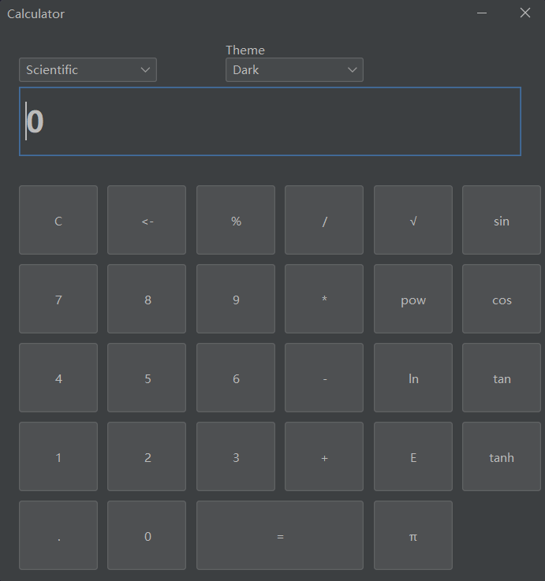
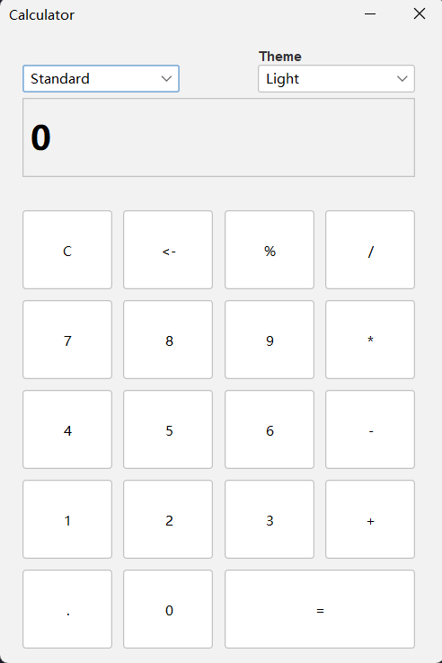

## An Calculator written in Java

### Dark theme

### Light theme


### Usage
clone the repo and run the command.
```cmd
mvn clean package && java -jar .\target\calc-0.1-with-dependencies.jar
```

### CI/CD
Forked the repo and trigger workflow in action.